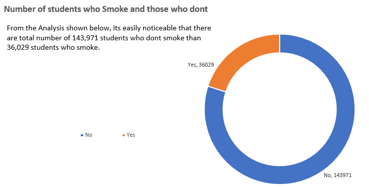

# Medical-Record-For-C-C-Secondary-School
### AVERAGE VALUES FOR MALE AND FEMALE (BMI,Temperature,Heart Rate,Blood Pressure,Cholesterol and Age)

## INSIGHTS
1. **Males** has **more** numbers of older people in terms of **Age.**
2. **Males** has **more** numbers on **Average Cholesterol.**
3. **Females** has **more** numbers on **BMI.**
4. **Females** has **more** numbers on **Average Heart Rate.**
5. **Females** has **more** numbers on **Blood Pressure.**
6. **Females** has **more** numbers on **Average Temperature.**

## AVERAGE HEIGHT AND WEIGHT FOR BOTH GENDERS

## INSIGHTS
1. **Females** has **more** numbers in **Weight.**
2. **Females** has **less** numbers in **Height.**
3. **Males** has **more** numbers in **Height.**
4. **Males** has **less** numbers in **Weight.**

## NUMBER OF STUDENTS ACCROSS THE DIFFERENT BLOOD GROUPS

## INSIGHTS
1. The highest number of Students fall under the **"O"** Blood Group.
2. Second to it is the **"B"** Blood Group with **45,537** number of Students.
3. Third is the **"AB"** Blood Group with **44,486** number of Students.
4. Fourth is the **"A"** Blood Group with **44,466** number of Students.

## NUMBER OF STUDENTS WHO SMOKE AND THOSE WHO DONT

## INSIGHTS
1. Total number of **143,971** are number of Students who dont **Smoke.**
2. Total number of **36,029** are number of Students who **Smoke.**

## RECOMMENDATIONS
From the analysis shown, i will recommend that the price of tobacco products
should be higher which inreturn its sales will depreciate. and more advert
should be carried out on all media on why smoking isnt good to the health.  

## NUMBER OF STUDENTS WHO HAVE DIABETES AND THOSE WHO DONT

## INSIGHTS
1. Total number of **161,986** Students lives without **Diabetes.**
2. Total number of **18,014** Students lives with **Diabetes.**

## RECOMMENDATIONS
More emphasis should be outlined on what causes diabetes and foods that are among
the causes of diabetes should be regulated within the school premises and equally on
how its been consumed by the students.

